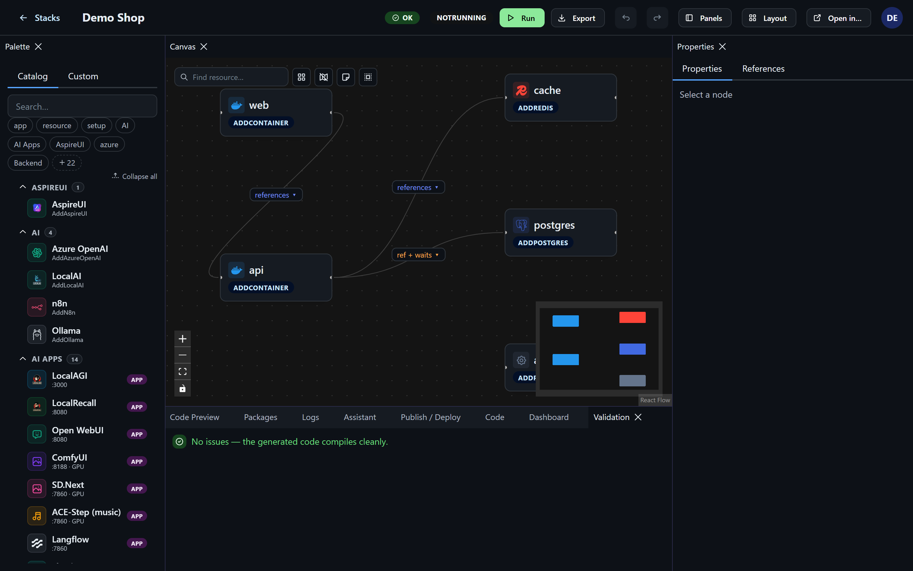
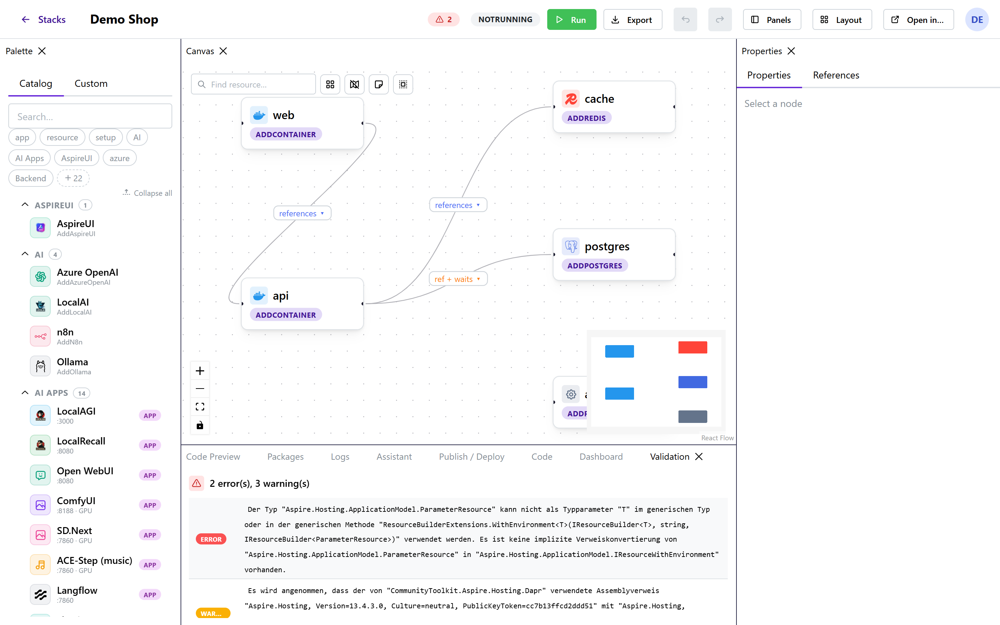
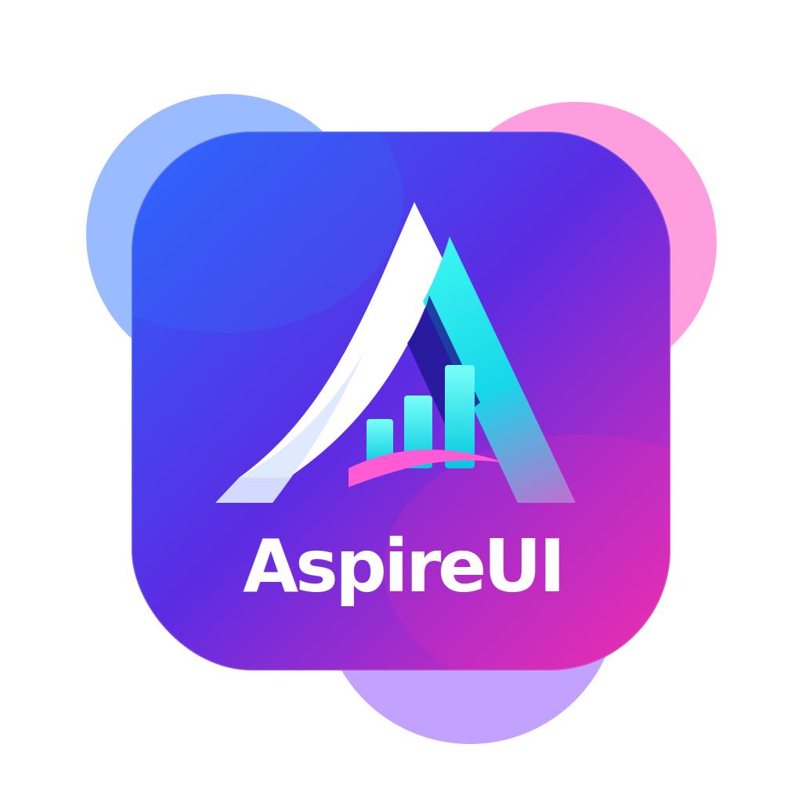

<p align="center"></p>

<p align="center">
  <a href="https://github.com/fgilde/AspireUI/actions/workflows/docker-publish.yml"></a>
  <a href="https://github.com/fgilde/AspireUI/pkgs/container/aspireui"></a>
  <a href="https://github.com/fgilde/AspireUI/releases"></a>
  
  <a href="https://github.com/fgilde/AspireUI/stargazers"></a>
  <a href="https://fgilde.github.io/AspireUI/"></a>
</p>

<p align="center">
  <sub>Powered by</sub>&nbsp;
  <a href="https://www.nuget.org/packages?q=Nextended.Aspire&includeComputedFrameworks=true&prerel=true">  <b>Nextended.Aspire</b></a>
  <a href="https://github.com/fgilde/Nextended"></a>
  &nbsp;·&nbsp;
  <a href="https://www.aspire.love/"> <b>aspire.love</b></a>
</p>

<hr>

<table>
  <tr>
    <td align="center"><b>GitHub Dark</b></td>
    <td align="center"><b>Blazor</b></td>
  </tr>
  <tr>
    <td></td>
    <td></td>
  </tr>
</table>

<sub>Read the <a href="https://fgilde.github.io/AspireUI/">docs</a> to find more.</sub>

<h1>
  
  AspireUI
</h1>

Visually build, import, and run .NET Aspire AppHost projects.

## Deploy

### One-click cloud


<p align="center">
  <a href="https://portal.azure.com/#create/Microsoft.Template/uri/https%3A%2F%2Fraw.githubusercontent.com%2Ffgilde%2FAspireUI%2Fmaster%2Fdeploy%2Fazuredeploy.json">
    
  </a>
  &nbsp;
  <a href="https://render.com/deploy?repo=https://github.com/fgilde/AspireUI">
    
  </a>
  &nbsp;
  <a href="https://deploy.cloud.run/?git_repo=https://github.com/fgilde/AspireUI">
    
  </a>
  &nbsp;
  <!--
  <a href="https://console.aws.amazon.com/cloudformation/home#/stacks/quickcreate?templateURL=https%3A%2F%2Fraw.githubusercontent.com%2Ffgilde%2FAspireUI%2Fmaster%2Fdeploy%2Faws-template.yaml&stackName=AspireUI">
    
  </a>
  --> 
  <!--
   Actual aws deploy template missing
  -->
</p>


> These spin up the prebuilt image on a managed container platform — perfect for **trying AspireUI**
> (build, import, publish, explore the catalog). Managed containers have **no host Docker socket**, so
> the in-app **Run** and **Hosting** features (which launch other containers) need self-hosting with
> Docker — see below. AWS / Google Compute / Linode / Hetzner have no standard one-click button; use the
> `docker run` line below on any VM there.

### Self-host with Docker (full features)

**Fastest** — pull the prebuilt image and run it (no clone, no build):

```bash
docker run -d --name aspireui -p 8080:8080 \
  -v aspireui-data:/data -v /var/run/docker.sock:/var/run/docker.sock \
  ghcr.io/fgilde/aspireui:latest
```

Or the installer, which clones the repo and starts it via Compose (and re-run to update):

```bash
bash -c "$(curl -fsSL https://raw.githubusercontent.com/fgilde/AspireUI/master/install.sh)"
```

Then open **http://localhost:8080**. Needs Docker + the Compose v2 plugin. The Docker socket mount lets
stacks you launch (and [hosted apps](docs/hosting.md)) start their own containers — see the security
note in `docker-compose.yml` and [Self-hosting](#run-on-a-server-docker).

> **On the host you only need Docker.** The official image bundles the .NET SDK, the Docker CLI +
> Compose plugin, and the `aspire` CLI — the in-app **Run** and **Hosting** features rely on all of
> them, so they're baked in rather than optional. You only install .NET/Git yourself when building from
> source or running AspireUI outside the image. The Docker socket mount (what powers Run/Hosting) is
> **root-equivalent on the host** — run AspireUI on an isolated/disposable box.

### Proxmox VE (one command)

On a Proxmox host, [`deploy/pve-install-aspireui.sh`](deploy/pve-install-aspireui.sh) spins up a clean
Debian VM, installs Docker, and runs AspireUI (socket mounted) — from nothing to a working URL:

```bash
# on the Proxmox host, as root:
bash pve-install-aspireui.sh
# or override defaults:
IP=192.168.1.50/24 GW=192.168.1.1 RAM=8192 CORES=4 DISK=40 bash pve-install-aspireui.sh
```

It prints `http://<vm-ip>:8080` when done; put that behind a reverse proxy (e.g. Nginx Proxy Manager)
for a real domain, and AspireUI can then manage that same NPM from **Settings → Hosting**. Tear it all
down with `qm stop <vmid> && qm destroy <vmid>`.

> **Why a VM, not an LXC:** AspireUI launches *other* containers through the Docker socket (Hosting),
> which needs real Docker — clean in a VM, fiddly with Docker-in-LXC on PVE. A disposable VM also
> contains the root-equivalent socket.

## What is AspireUI

AspireUI is a visual canvas for [.NET Aspire](https://learn.microsoft.com/dotnet/aspire/) AppHost
projects. Drag out resources, wire up references, tweak properties in a grid, and watch the
generated C# update live — then run the stack and jump straight into the Aspire dashboard. Import an
existing AppHost (`.cs` / `.csproj` / `.zip`) to start from what you already have, or spin up a demo
template to explore.

Docs site (in progress): **https://fgilde.github.io/AspireUI/**

## Features

- Visual canvas for composing an AppHost, backed by an intelligent reflection-based capability catalog
- Dynamic "add resource" dialog driven by the catalog (new Aspire integrations show up automatically),
  with a live C# preview and reference wiring in both directions
- **Setup / macro extensions** — composite helpers like `AddObservabilityStack` / `AddDapr` (which set
  up several resources at once) are auto-discovered and grouped under "Setup"
- Property grid for editing resource arguments and capabilities, with type-filtered
  resource-reference pickers (and inline "create the dependency" ＋), and a server-side path picker
  for project/folder params
- Reference wiring between resources
- Reopen closed dock panels from a **Panels** menu
- Live C# preview of the generated `Program.cs`, kept in sync with the canvas
- **Code editor** (Monaco) with real C# IntelliSense (Roslyn-backed); edits re-parse into the graph
- Run / stop a stack, with a link straight into the Aspire dashboard
- **Live resource view** — while a stack runs, the canvas shows real per-resource status, endpoint
  URLs, and the child resources each builder spawns (from the Aspire resource service), plus
  **per-resource console-log streaming**
- Publish a stack to **Docker Compose / Kubernetes (Helm) / Azure Bicep / Aspire manifest** (via
  `aspire publish`): view the generated artifact, download the bundle, or deploy Compose locally
- **Hosting — install &amp; forget**: deploy a stack as a persistent, tracked appliance with a URL,
  start/stop/update/backup, and a one-click **app store** (Umbrel/CasaOS style) — see [Hosting](docs/hosting.md)
- **139+ preconfigured container apps** (Immich, Jellyfin, Nextcloud, Gitea, n8n, Pi-hole, …) ready to
  drop on the canvas or install from the store — see the [App Catalog](docs/apps.md)
- NuGet packages panel for the AppHost project
- Import an existing AppHost from `.cs`, `.csproj`, or a `.zip` — or a `docker-compose.yml`
- Demo templates to start from a working example
- Built-in AI assistant to help build and modify stacks
- Themes, command palette (Ctrl/⌘+K), saveable dock layouts, undo/redo
- Dockable panels — arrange the workspace the way you like

## Quick start (development)

Requires the .NET SDK (10.0+).

```bash
dotnet run --project src/AspireUI.Server
```

Opens at **http://localhost:5158**.

## Run on a server (Docker)

The included `Dockerfile` / `docker-compose.yml` run AspireUI as a self-contained container — useful for
a home server, Proxmox VM, or any Docker host.

```bash
./install.sh
```

or manually:

```bash
docker compose up -d --build
```

Then open **http://localhost:8080**.

The container mounts the host's Docker socket so that stacks launched from AspireUI can start their own
containers on the host — see the security note in `docker-compose.yml`.

## Configuration

| Variable          | Default                  | Meaning                                            |
|--------------------|---------------------------|-----------------------------------------------------|
| `ASPNETCORE_URLS`  | `http://0.0.0.0:8080`     | Address(es) the server listens on (published build) |
| `DB_PATH`          | `/data/aspireui.db`       | SQLite database file for stacks/settings            |
| `WORKSPACE_DIR`    | `/data/workspace`         | Where generated AppHost projects are written to run  |
| `ASPIREUI_ADMIN_USERNAME` | *(unset)*          | First-run only: create this admin (skipped once any user exists) |
| `ASPIREUI_ADMIN_PASSWORD` | *(unset)*          | Password for the seeded admin (stored hashed) |
| `ASPIREUI_SEED_STACK_NAME` | *(unset)*         | Seed a starter stack of this name on first start |
| `ASPIREUI_SEED_STACK_PROJECTS` | *(unset)*     | `;`/`,`-separated project paths → one `AddProject` node each in the seeded stack |
| `ASPIREUI_SET_<Key>` | *(unset)*              | **Seed any setting** from env (see below) — ships a pre-configured image |
| `ASPIREUI_SET_FORCE` | `false`                | `true` = `ASPIREUI_SET_*` overrides existing values on every start (default: fill only what's unset) |

### Pre-seeding settings (`ASPIREUI_SET_*`)

Every in-app setting can be seeded from the environment so an image comes up pre-configured — no setup
wizard. Use `ASPIREUI_SET_<Key>` with the exact setting key. By default a value is only written when
that setting is still empty (so a user's later change sticks); set `ASPIREUI_SET_FORCE=true` to always
apply. Known keys:

| Area | Keys |
|------|------|
| **AI assistant** | `AiKind` (`http`/`cli`), `AiBaseUrl`, `AiApiKey`, `AiModel`, `AiProviderLabel`, `AiCliTool` |
| **Hosting dashboard** | `HostDashboard` (`true`/`false`), `DashboardToken` |
| **Nginx Proxy Manager** | `NpmEnabled` (`true`/`false`), `NpmBaseUrl`, `NpmEmail`, `NpmPassword`, `NpmForwardHost` |

```bash
docker run -d -p 8080:8080 -v aspireui-data:/data -v /var/run/docker.sock:/var/run/docker.sock \
  -e ASPIREUI_ADMIN_USERNAME=admin -e ASPIREUI_ADMIN_PASSWORD='change-me' \
  -e ASPIREUI_SET_AiBaseUrl=http://ollama:11434 -e ASPIREUI_SET_AiModel=llama3.2 \
  -e ASPIREUI_SET_NpmEnabled=true -e ASPIREUI_SET_NpmBaseUrl=http://npm:81 \
  ghcr.io/fgilde/aspireui:latest
```

## API &amp; MCP (agents)

The whole product is a REST API. The OpenAPI spec is at **`/openapi/v1.json`** with a browsable
**Scalar** reference UI at **`/scalar`** (account menu → *API reference*).

Auth is either the browser session cookie or a **personal access token** — create one under
**Settings → API &amp; Agents** and send it as `Authorization: Bearer <token>` on any `/api/...` call.

Agents can drive AspireUI through the built-in **MCP server** at **`/api/mcp`** (same Bearer auth). Tools:
inspect stacks (`list_stacks`, `get_stack`), browse the catalog (`search_apps`), author
(`create_stack`, `install_app`, `add_resource`, `delete_stack`), and run/host
(`run_stack`, `stop_run`, `deploy_to_hosting`, `start_hosting`, `stop_hosting`, `hosting_logs`). Add it
to an MCP-capable agent:

```json
{
  "mcpServers": {
    "aspireui": {
      "url": "http://<host>:8080/api/mcp",
      "headers": { "Authorization": "Bearer <your-token>" }
    }
  }
}
```

A prebuilt image is published to **`ghcr.io/fgilde/aspireui:latest`** on every push, so you can
`docker run` it directly instead of building.

## Notes / limitations

- **Running a stack** shells out to `dotnet run` on a generated AppHost project, and Aspire resources
  frequently start containers — this needs the .NET SDK and Docker available wherever AspireUI runs
  (the Docker image above includes both).
- Login-gated (a first-run wizard creates the admin user), but still a small-team, local-first tool —
  don't expose its port directly to the internet without a reverse proxy and TLS in front.
- The built-in AI assistant needs a configured OpenAI-compatible endpoint (see Settings) to do anything.

## Screenshots

A running **Supabase + Observability** stack — builder nodes show live per-resource status and the
child resources they spawned (`supabase-db`, `supabase-auth`, the `monitoring-*` stack, …):


<table>
  <tr>
    <td align="center"><b>Live Resources | Running Overview</b></td>
    <td align="center"><b>Complex Application shared user and password</b></td>
  </tr>
  <tr>
    <td>
      
    </td>
    <td>
      
    </td>
  </tr>

  <tr>
    <td align="center"><b>Dashboard</b></td>
    <td align="center"><b>Environment edit in Hosting</b></td>
  </tr>
  <tr>
    <td>
      
    </td>
    <td>
      
    </td>
  </tr>

  <tr>
    <td align="center"><b>Hosting Treeview</b></td>
    <td align="center"><b>Settings</b></td>
  </tr>
  <tr>
    <td>
      
    </td>
    <td>      
      
    </td>
  </tr>

  <tr>
    <td align="center"><b>Add Aspire resource</b></td>
    <td align="center"><b>Code match for selection</b></td>
  </tr>
  <tr>
    <td>
      
    </td>
    <td>
      
    </td>
  </tr>
</table>


More detail: **https://fgilde.github.io/AspireUI/**
