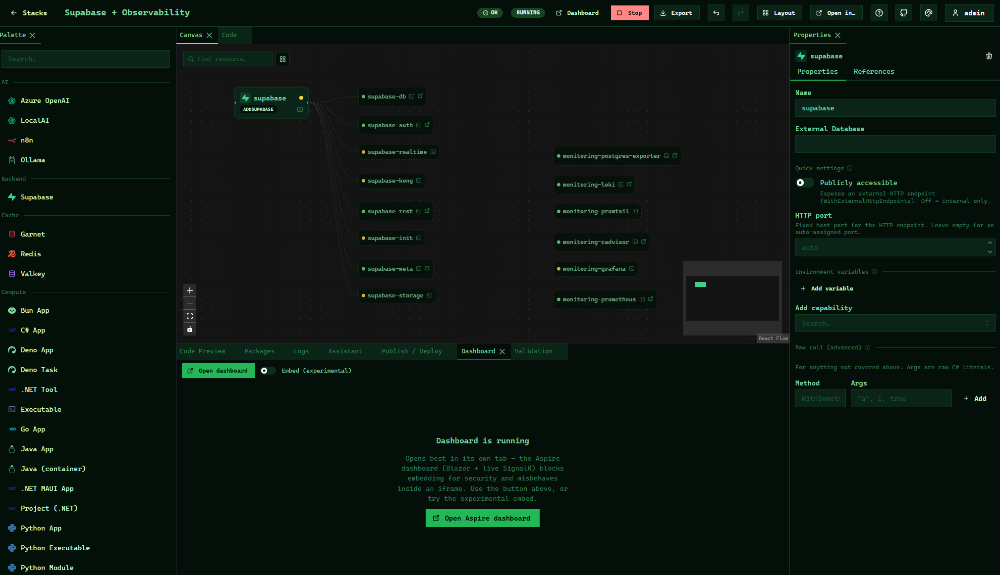

# AspireUI

Visually build, import, and run .NET Aspire AppHost projects.

## What is AspireUI

AspireUI is a visual canvas for [.NET Aspire](https://learn.microsoft.com/dotnet/aspire/) AppHost
projects. Drag out resources, wire up references, tweak properties in a grid, and watch the
generated C# update live — then run the stack and jump straight into the Aspire dashboard. Import an
existing AppHost (`.cs` / `.csproj` / `.zip`) to start from what you already have, or spin up a demo
template to explore.

Docs site (in progress): **https://fgilde.github.io/AspireUI/**

## Features

- Visual canvas for composing an AppHost, backed by an intelligent reflection-based capability catalog
- Dynamic "add resource" dialog driven by the catalog (new Aspire integrations show up automatically),
  with a live C# preview and reference wiring in both directions
- **Setup / macro extensions** — composite helpers like `AddObservabilityStack` / `AddDapr` (which set
  up several resources at once) are auto-discovered and grouped under "Setup"
- Property grid for editing resource arguments and capabilities
- Reference wiring between resources
- Live C# preview of the generated `Program.cs`, kept in sync with the canvas
- **Code editor** (Monaco) with real C# IntelliSense (Roslyn-backed); edits re-parse into the graph
- Run / stop a stack, with a link straight into the Aspire dashboard
- **Live resource view** — while a stack runs, the canvas shows real per-resource status, endpoint
  URLs, and the child resources each builder spawns (from the Aspire resource service), plus
  **per-resource console-log streaming**
- Publish a stack to **Docker Compose / Kubernetes (Helm) / Azure Bicep / Aspire manifest** (via
  `aspire publish`): view the generated artifact, download the bundle, or deploy Compose locally
- NuGet packages panel for the AppHost project
- Import an existing AppHost from `.cs`, `.csproj`, or a `.zip` — or a `docker-compose.yml`
- Demo templates to start from a working example
- Built-in AI assistant to help build and modify stacks
- Themes, command palette (Ctrl/⌘+K), saveable dock layouts, undo/redo
- Dockable panels — arrange the workspace the way you like

## Quick start (development)

Requires the .NET SDK (10.0+).

```bash
dotnet run --project src/AspireUI.Server
```

Opens at **http://localhost:5158**.

## Run on a server (Docker)

The included `Dockerfile` / `docker-compose.yml` run AspireUI as a self-contained container — useful for
a home server, Proxmox VM, or any Docker host.

```bash
./install.sh
```

or manually:

```bash
docker compose up -d --build
```

Then open **http://localhost:8080**.

The container mounts the host's Docker socket so that stacks launched from AspireUI can start their own
containers on the host — see the security note in `docker-compose.yml`.

## Configuration

| Variable          | Default                  | Meaning                                            |
|--------------------|---------------------------|-----------------------------------------------------|
| `ASPNETCORE_URLS`  | `http://0.0.0.0:8080`     | Address(es) the server listens on (published build) |
| `DB_PATH`          | `/data/aspireui.db`       | SQLite database file for stacks/settings            |
| `WORKSPACE_DIR`    | `/data/workspace`         | Where generated AppHost projects are written to run  |

The AI provider (OpenAI-compatible endpoint, model, key) is configured in-app under **Settings** — no
environment variables needed for that.

## Notes / limitations

- **Running a stack** shells out to `dotnet run` on a generated AppHost project, and Aspire resources
  frequently start containers — this needs the .NET SDK and Docker available wherever AspireUI runs
  (the Docker image above includes both).
- Login-gated (a first-run wizard creates the admin user), but still a small-team, local-first tool —
  don't expose its port directly to the internet without a reverse proxy and TLS in front.
- The built-in AI assistant needs a configured OpenAI-compatible endpoint (see Settings) to do anything.

## Screenshots

A running **Supabase + Observability** stack — builder nodes show live per-resource status and the
child resources they spawned (`supabase-db`, `supabase-auth`, the `monitoring-*` stack, …):




More detail: **https://fgilde.github.io/AspireUI/**
