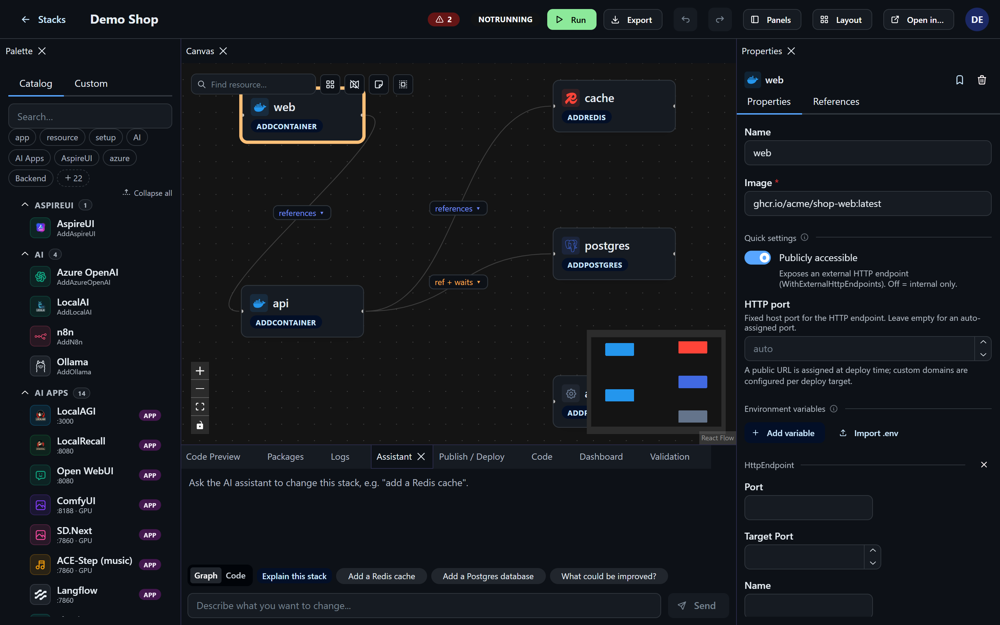
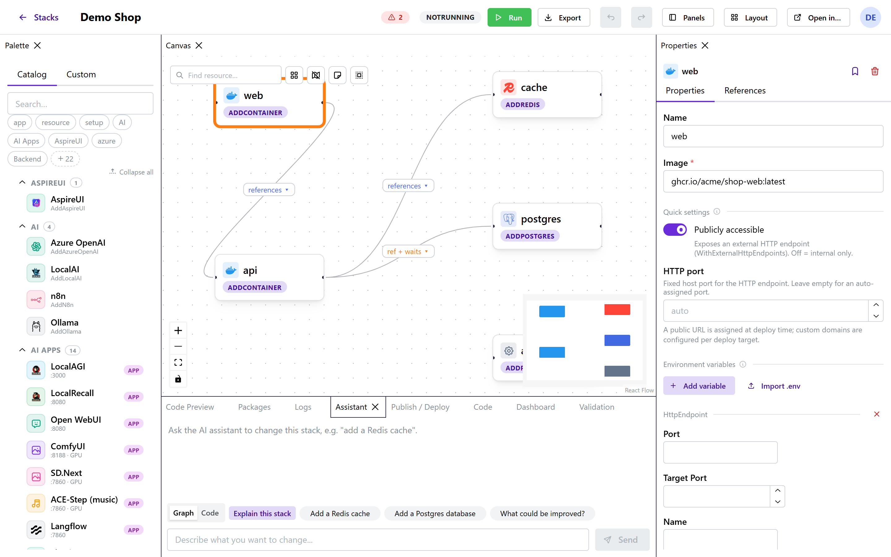

# AI Assistant

AspireUI has a built-in assistant that edits your stack for you: describe what you want ("add
Coolify", "wire n8n to a new postgres", "add a Redis cache and reference it from the api") and it
applies the change directly to the canvas.

## Configure a provider

Open **Settings → AI assistant** and pick a backend:

**HTTP endpoint** — any OpenAI-compatible service exposing `POST {baseUrl}/v1/chat/completions`
(your own LocalAI/Ollama, OpenAI itself, …):

- **Base URL**, **API key** (bearer token, masked once saved), **Model**, and a friendly **Provider
  label**. Hit **Detect** to list the endpoint's models, and **Test connection** for a live round-trip
  that reports the model + latency or the exact error.

**Local CLI** — an agent CLI installed on the machine running AspireUI: **claude**, **gemini**,
**llm**, **ollama** or **codex** (whitelisted; the server runs the fixed executable with your prompt,
never a shell). Pick the tool and a model where relevant, then **Test connection**.

AspireUI deliberately doesn't hardcode a single AI vendor. Settings are stored server-side (SQLite),
separate from your stacks, so they apply across all of them. Until a backend is configured the
assistant tells you to set one up in Settings.

## Using the assistant

In the editor, open the **Assistant** panel, type a request, and send it. AspireUI sends the
current stack plus a compact summary of the catalog (available resource types and their parameters)
to the configured model and asks for an updated stack back. On success, the change is applied to the
canvas and code preview immediately; the assistant's reply text (plus any error) shows in the panel.
Each answer can be dismissed individually, or clear the whole thread.

A **Graph / Code** toggle picks how the assistant works: *Graph* edits the resource model directly
(default); *Code* rewrites the generated `Program.cs` and re-parses it — more robust for backends that
don't reliably produce the graph JSON.

A few things to know:

- Each request is **stateless** — there's no multi-turn memory, so include whatever context the
  model needs in the prompt itself.
- Replies are **not streamed** — you'll see a spinner until the full response comes back.
- If the model returns something that doesn't compile or doesn't parse as a valid stack, AspireUI
  rejects it (same syntax check as saving by hand) and shows you why in the reply instead of
  silently corrupting your stack.
- Because the assistant picks from the same catalog the palette uses, it can add anything already
  available there — containers, databases, GitHub repositories, Ollama models, and so on — without
  any extra wiring on your part.
