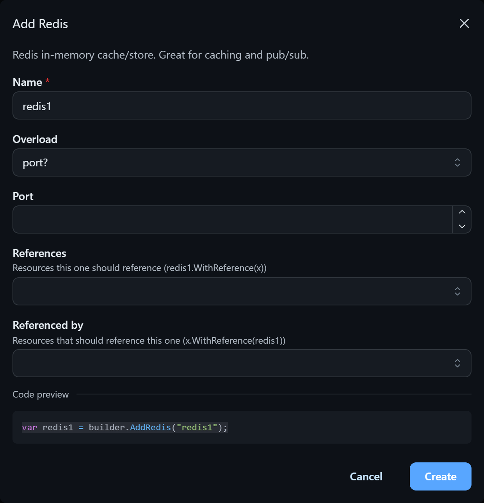
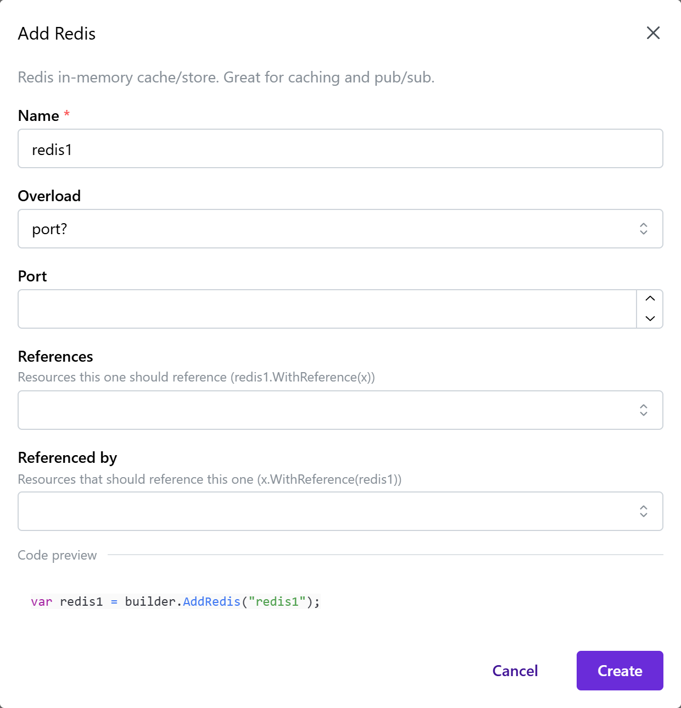
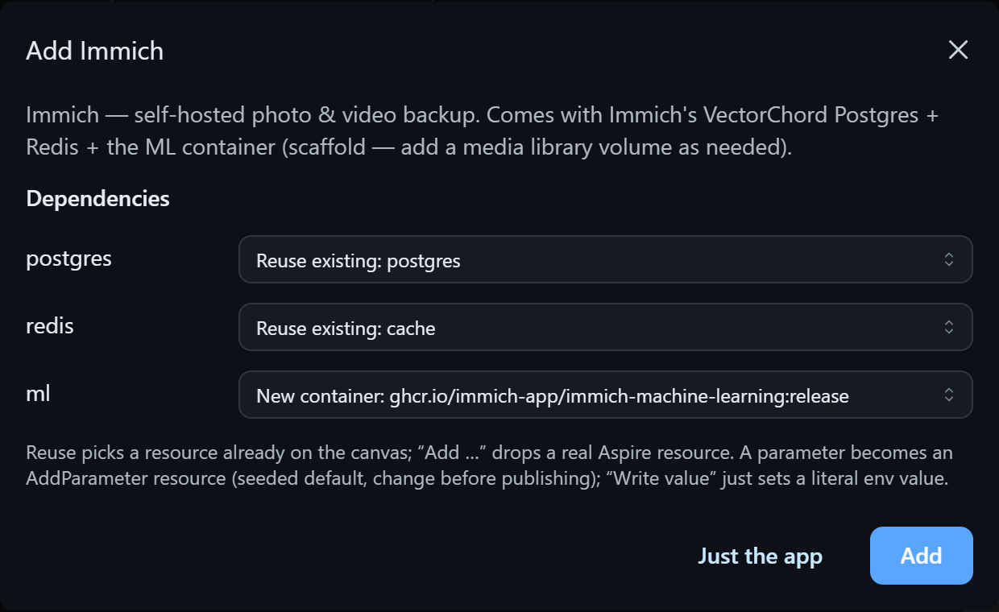
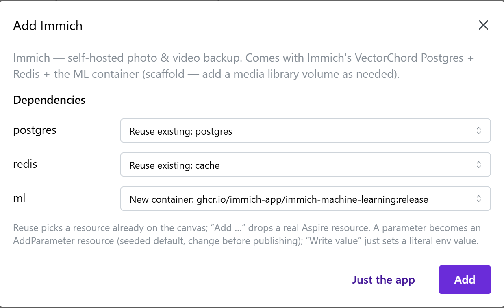
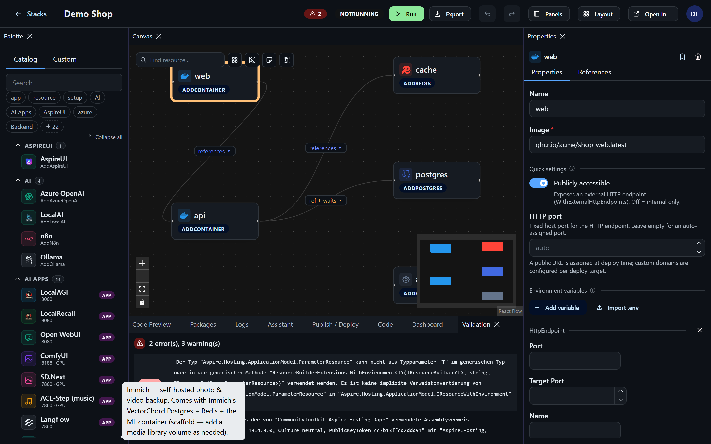
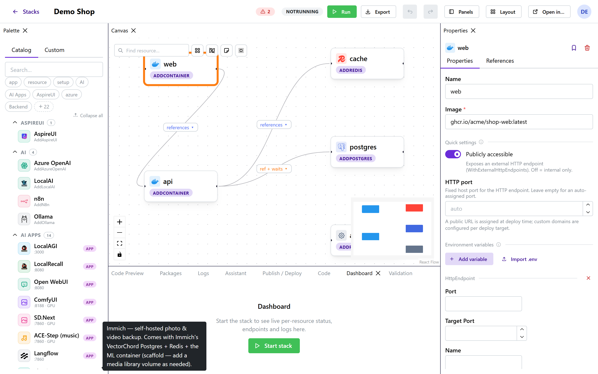
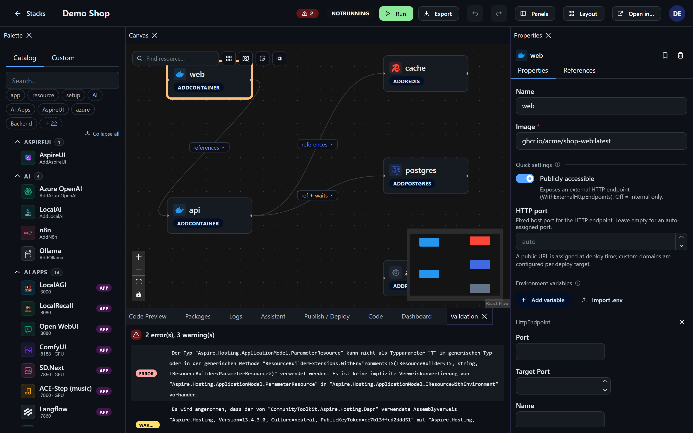
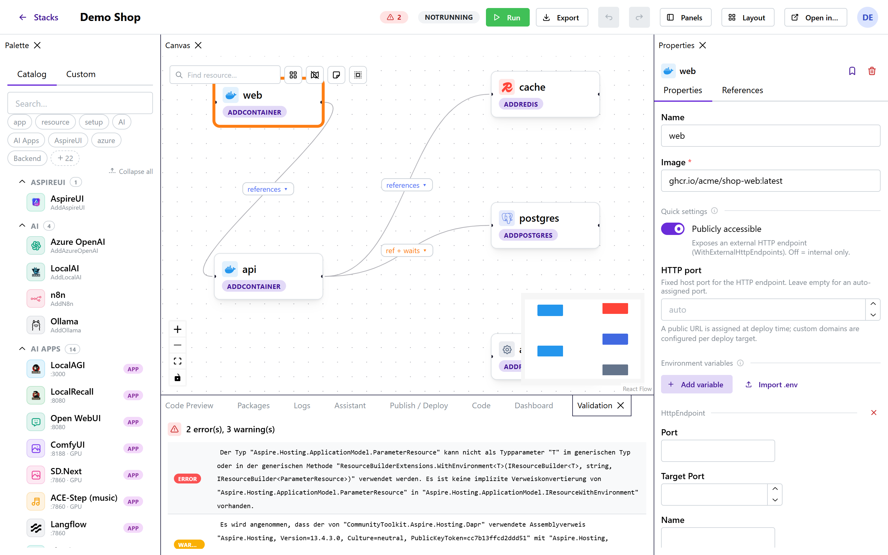
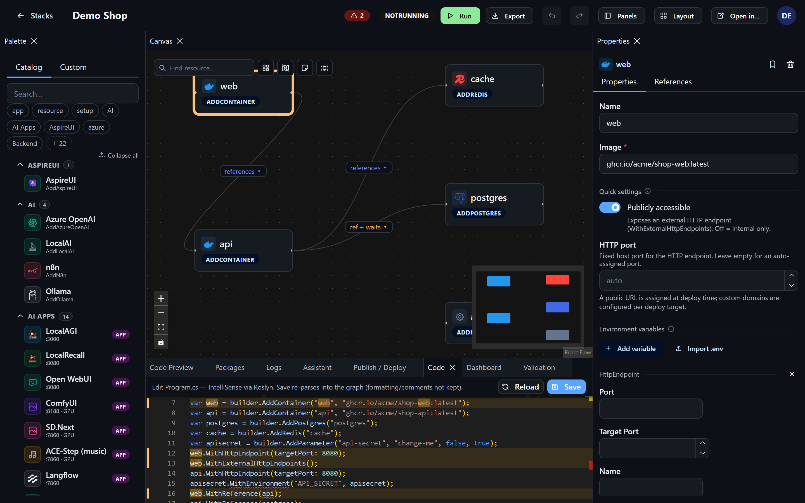
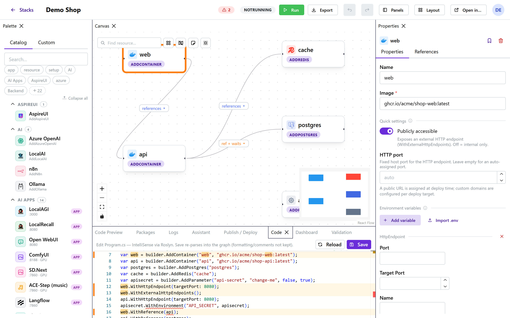

# Building Stacks

A stack is a canvas of resource nodes and references between them, backed 1:1 by an Aspire AppHost
`Program.cs`. Everything you do in the editor keeps that C# in sync — the **Code preview** panel is
a live, read-only view of exactly what will be generated.

## The canvas

Nodes are resources (with a brand icon per type); edges are connections. The canvas has a **minimap**,
**auto-arrange** (dagre layout) and a **resource search** box (top-left), **snap-to-grid**, and a
**right-click context menu** per node (edit properties / duplicate / delete). Dragging is live.

While the stack runs, each node shows its **real per-resource status** (a traffic-light dot) and a
link to the endpoint it exposes, and the resources a builder spawns appear as live child nodes — see
[Live Resources & Logs](live-resources.md).

## The palette

The palette lists every resource type AspireUI knows about, grouped (Database, Cache, Messaging,
Search, Vector, Identity, AI, Compute, Integration, Observability, …). This list isn't hardcoded:
it's built by **reflecting** over the referenced Aspire hosting assemblies — the official
`Aspire.Hosting.*` packages plus `CommunityToolkit.Aspire.*` and Nextended integrations — so new
Aspire integrations show up automatically once their package is referenced. A curated overlay adds
friendly labels, brand logos, grouping and descriptions on top; resources without an overlay still
work generically. The generated project only references the packages for resources you actually use.

Click a palette entry to open its add dialog. Switch to the **Custom** tab for one-click **app
presets** (see below) and your own saved snippets.

### Setup / composite extensions

The catalog also surfaces **macro extensions** — methods that take the builder and wire up *several*
resources at once (they return the builder, not a single resource), e.g. Nextended's
`AddObservabilityStack` or CommunityToolkit's `AddDapr`. These are discovered the same way as regular
resources and grouped under **Setup**. Adding one drops a **statement node** on the canvas (it emits
`builder.AddX(...)` rather than `var x = builder.AddX(...)`); if it takes a resource reference (e.g.
"which Supabase to attach observability to"), the dialog lets you pick an existing node for it. At run
time you'll see everything it created via the [live child-resource view](live-resources.md).

## The add-resource dialog

Adding a resource opens a form (not a bare node) that also teaches you the Aspire API:

- A one-line **description** of what the resource is.
- **Name** — required; becomes the resource's variable name in the generated code.
- If the `AddX` method has more than one usable **overload**, a selector picks the signature.
- The overload's parameters as typed controls: `string` → text, numeric → number, `bool` → switch,
  `enum` → dropdown, a **resource-reference** parameter → a picker of existing nodes, and
  **configure-lambdas** (`Action<TOptions>`) expand into their settable fields (e.g. a GitHub repo's
  `GitRef` branch).
- **References** — a multiselect of existing resources this one should reference; picking them adds
  the matching `${new}.WithReference(x)` edges on create.
- **Referenced by** — the inverse multiselect: existing resources that should reference the new one
  (adds `x.WithReference(${new})` edges), so you can wire a resource into things that already exist.
- A **live code preview** shows the exact C# the dialog will generate as you type — including the
  reference wiring in both directions — great for learning what each option produces.

## App presets & their dependencies

Beyond raw Aspire resources, the palette ships a big library of **one-click app presets** — ready-to-run
containers like Jellyfin, the *arr apps + qBittorrent, Immich, Paperless, Pi-hole, AdGuard, Home
Assistant, Node-RED, LibreChat, Open WebUI, ComfyUI, code-server and many more — each with the right
image, ports, volumes and environment pre-filled.

Many apps need **backing services** (a database, cache, search engine, LLM). When you drop such a
preset, AspireUI asks how to satisfy each dependency — reuse a resource already on the canvas, drop a
fresh container, or add a real Aspire resource — so you never end up with duplicate Postgres/Redis
instances. Passwords and secrets are offered as **Aspire parameters** (or a plain value), and are
seeded with a changeable default.

Here Immich is being added to a stack that already has Postgres and Redis — its `postgres` and `redis`
dependencies default to **reusing** the existing ones, while the ML service gets its own container:

Everything a preset drops (the app, its companions, its parameters) is wired together on the canvas
with the appropriate `WithReference` / `WaitFor` edges and env references — ready to tweak.

## The property grid

Selecting a node shows its editable fields, and highlights the exact lines it produces in the **Code**
panel (see [Learn Aspire as you build](#learn-aspire-as-you-build)).

Small **ℹ️ icons** on the sections explain the underlying Aspire concept as you go.

- **Quick settings** (for resources with endpoints): a **Publicly accessible** toggle
  (`WithExternalHttpEndpoints()`) and an **HTTP port** field (`WithHttpEndpoint(port:)`) — the common
  cases, with full control still available below.
- The **Add** parameters, re-derived from the overload.
- A **capabilities** section: every `With*` method on the resource **and** every `Add*` method on its
  own builder (e.g. `ollama.AddModel(...)`, `pg.AddDatabase(...)`). Each lists its calls as editable
  rows with an add-row form.
- **Environment variables** as a name/value list. Each value has a **Text ⇄ Expr** toggle — Text is a
  quoted string literal; **Expr** is raw C# (e.g. another resource's endpoint). In Expr mode a 🔗 menu
  lets you **insert a reference** to another resource (its HTTP endpoint or connection string). Free
  typing always works.
- **Resource-reference parameters** (an `IResourceBuilder<T>` arg, e.g. a Grafana datasource's
  `postgres`): a picker of the stack's existing resources, filtered to the matching type. A **＋** next
  to it lets you **create the needed resource inline** — it opens a type-matching add dialog, and the
  resource you create is saved and selected back into the field in one go.
- **Path parameters** (a project/working-directory/config path, e.g. a Deno or C# app): a **📁 Browse**
  button opens a server-side path picker that browses the *host* filesystem (folders navigable,
  keyboard-driven, mouse Back steps up) — because the path has to resolve on the machine that runs the stack.
- A generic **raw-call** escape hatch for anything the catalog doesn't cover — editing is never blocked.

The same resource-reference picker (with inline **＋** create) and path Browse button also appear in
the **add-resource dialog**, so you can wire and create dependencies while adding a resource.

## References & dependencies

Wire resources by dragging an edge on the canvas, via the References picker in the properties panel,
or straight from the add dialog. Click an edge's chip to open its menu: toggle **References**
(`WithReference`) and **Waits for** (`WaitFor`) independently (both can apply), **reverse** the
direction, or **remove** the connection. `WaitFor`-only edges render dashed.

## Validation

The **Validation** panel (and the health badge in the header) run Roslyn diagnostics over the
generated code and list any errors/warnings. Clicking the badge focuses the panel and flashes it.

## Code preview

The **Code preview** panel is the generated `Program.cs`, syntax-highlighted, refreshed after every
save. It's read-only — think of it as a live receipt, not an editing surface. Nothing you do bypasses
it: every change on the canvas or in the property grid is round-tripped through the same model that
generates this code.

## Learn Aspire as you build

AspireUI doubles as a way to *learn* .NET Aspire. Select any node and the **Code** panel highlights
exactly the lines that resource produces — a gutter marker on every line, the node's variable name
emphasised, and it scrolls the first one into view. Combined with the add-dialog's live preview and the
property grid's ℹ️ hints, you can always see the C# behind each visual action.

## Code editor (Monaco + C# IntelliSense)

The **Code** panel is a full editor for `Program.cs` with C# **IntelliSense** — completion, signature
help, hover, and live error squiggles — backed by Roslyn on the server. Use it for things the visual
model can't express directly (a `configure` lambda like `o => o.GitRef = "master"`, an expression, a
bit of custom wiring). **Save** (button or Ctrl+S) re-parses your code back into the node graph, so the
canvas stays in sync — anything the graph can't represent is kept as a raw statement. Note: because the
code is regenerated canonically from the model, **your formatting and comments are not preserved** on
save. Compile/parse errors are shown inline and your edits are kept so you can fix them. (The editor
only analyzes — it never runs your code.)

## Packages panel

The **Packages** panel lists every NuGet package the generated AppHost project needs, and which
resource(s) pulled each one in — handy for sanity-checking what a stack actually depends on before
you run or export it.
