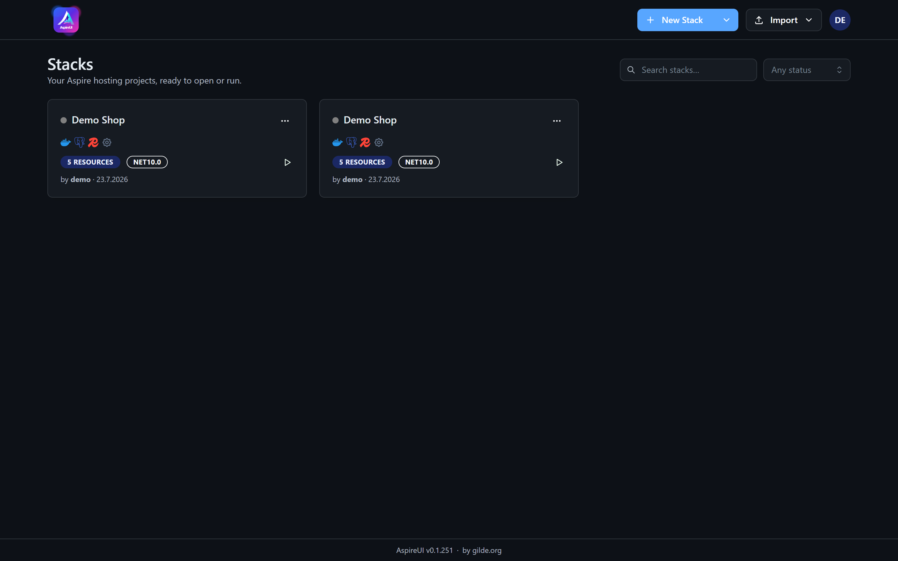
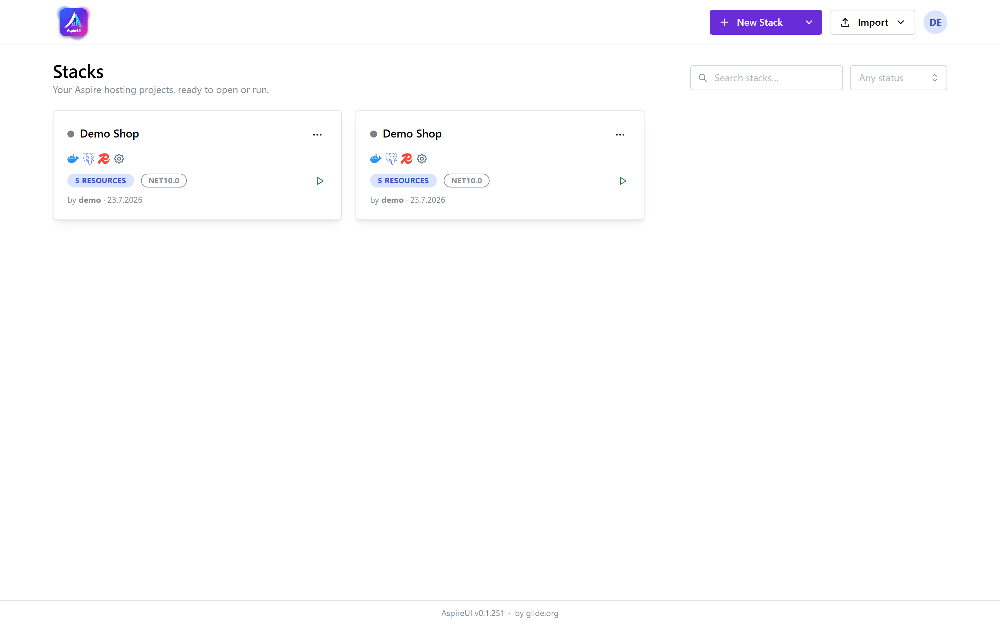

# Getting Started

## Run it

AspireUI is an ASP.NET Core server (net10.0) that serves the React SPA. For development:

```bash
dotnet run --project src/AspireUI.Server
```

Opens at **http://localhost:5158**.

To self-host on a server instead, see [Running & Deploying](running-and-deploying.md).

## First run: create the admin

On first launch AspireUI runs a **setup wizard**: it checks your environment (.NET SDK, Docker, git)
and has you create the first **admin** user. After that you log in with username/password; admins can
add more users under **Users**. It's cookie-based auth for a small-team, local-first tool — put a
reverse proxy + TLS in front before exposing it beyond localhost.

## Your first stack

<div class="img-compare"></div>

1. The **Stacks overview** lists your stacks — each card shows a live status traffic-light and
   run/stop/open-dashboard buttons, plus a ⋯ menu (rename / duplicate / delete) and a search box.
   With no stacks yet, the empty state offers **New Stack** and a **template picker** right there.
2. Click **New Stack** to start blank, use the **demo dropdown** to create a runnable example
   (see below), or **Import** an existing AppHost / a `docker-compose.yml` — either way you land in
   the editor.
3. In the editor, click a resource in the **Palette** to add it (the add dialog previews the C# it
   generates), or import an existing AppHost (see [Importing](importing.md)).
4. Select a node to edit it in the **Properties** panel, wire up references between nodes, and watch
   the **Code preview** update with the generated `Program.cs`.
5. Hit **Run** to start the stack. Your nodes light up with real per-resource status and URLs, the
   resources each builder spawns appear as live child nodes, and a terminal button streams any
   resource's logs — see [Live Resources & Logs](live-resources.md). Open the **Dashboard** panel or
   the Aspire dashboard link for full telemetry.

The editor itself — palette on the left, canvas in the middle, properties on the right, dockable
panels along the bottom:

<div class="img-compare"></div>

## Demo templates

The overview's demo dropdown creates a ready-to-run stack without building one by hand:

- **Local AI Demo** — Ollama (+ models via `AddModel`), LocalAI, and n8n (waiting on both), CPU-safe.
- **Web backend** — Postgres + Redis + RabbitMQ.
- **Elasticsearch + Kibana** — ES with a Kibana UI wired to it.
- **Kafka + UI** — Kafka broker with the provectus Kafka-UI.
- **Keycloak + Postgres** — identity server backed by Postgres.
- **Observability (Seq)** — a Seq log server.
- **Grafana + Prometheus + OTEL** — Grafana dashboards, Prometheus metrics, and an OpenTelemetry
  collector as containers.
- **Supabase + Observability** — a full Supabase backend wired to Nextended's `AddObservabilityStack`
  macro (Grafana / Prometheus / Loki / Tempo / OTEL). Great for seeing the live child-resource view
  in action.

## Layout, themes & shortcuts

The workspace is built from dockable panels (Palette, Canvas, Properties, Code preview, Packages,
Logs, Assistant, Publish/Deploy, Code, Dashboard, Validation) — split, tab, float, and drag them,
save named **layouts**, pick a **theme**, and use the **command palette** (Ctrl/⌘+K). See
[UI, Themes & Shortcuts](ui-and-shortcuts.md).
