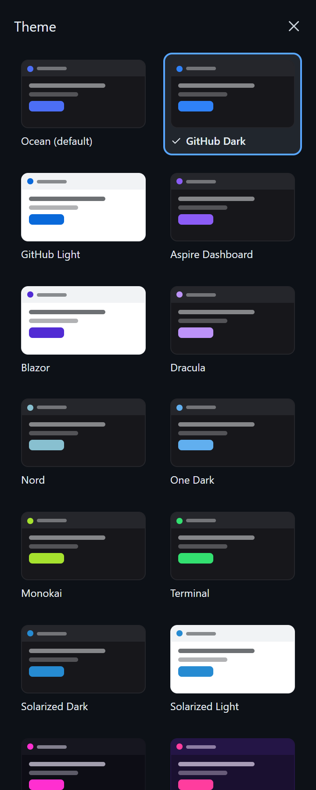
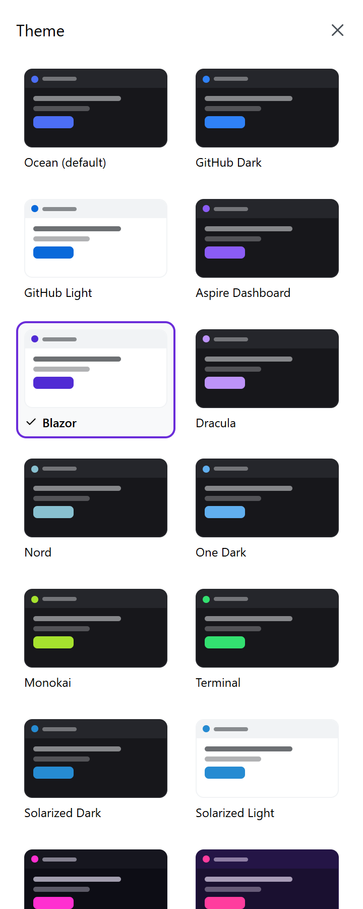
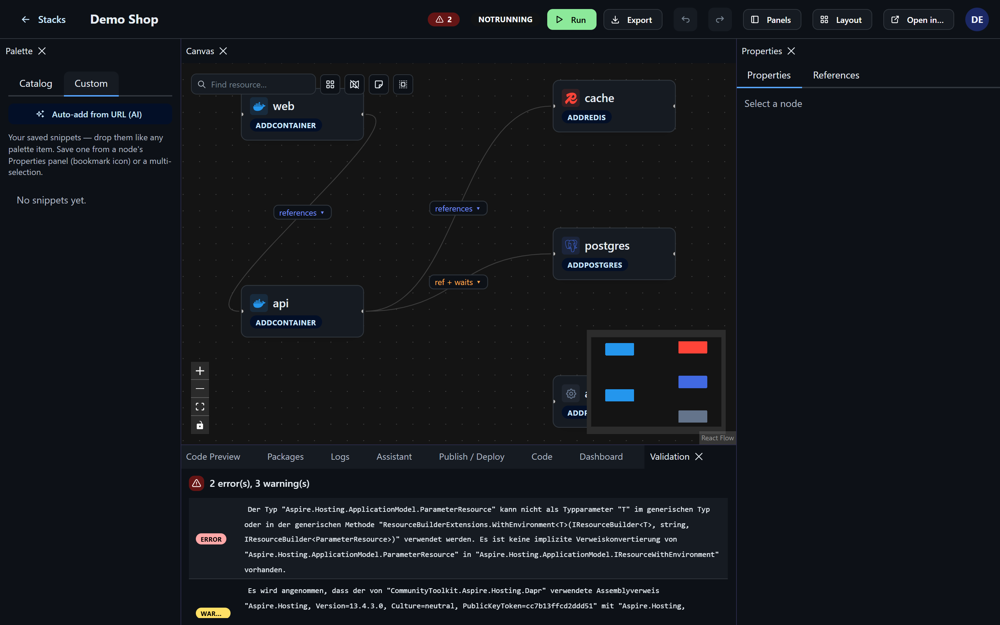
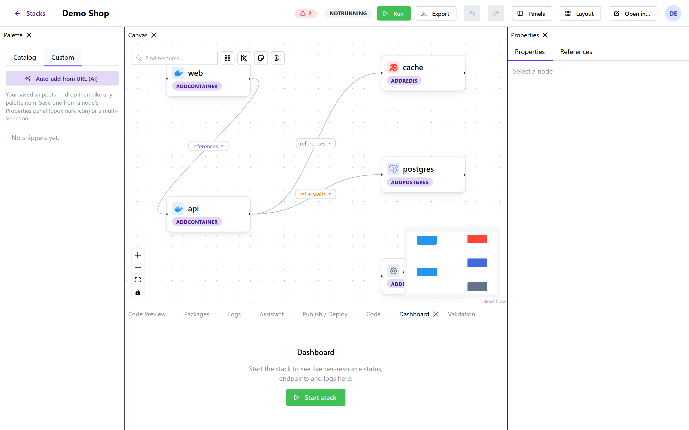
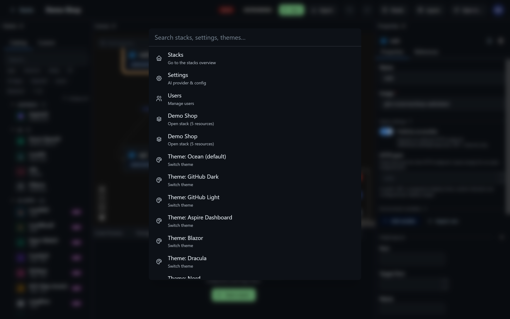
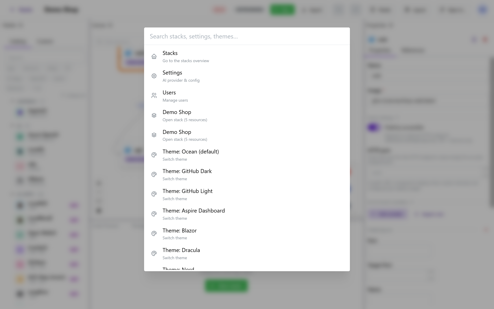

# UI, Themes & Shortcuts

## Dockable panels

The editor is a dockable workspace (powered by dockview). Every panel — Canvas, Palette, Properties,
Code Preview, Packages, Logs, Assistant, Publish / Deploy, Code, Dashboard, Validation — can be
dragged, split, stacked into tabs, floated, or closed. The panel backgrounds follow the active theme.

### Panels menu

Closed a panel by mistake? The **Panels** menu (editor header, next to Layout) lists every panel —
Canvas, Palette, Properties, Code Preview, Packages, Logs, Assistant, Publish / Deploy, Code,
Dashboard, Validation — with a check for the ones currently open. Click to show or hide; a reopened
side panel re-docks next to the canvas, the rest rejoin the bottom tab group.

### Saved layouts

The **Layout** menu (editor header) lets you:

- **Save current layout…** under a name,
- **load** a saved layout by clicking it,
- **delete** one (trash icon), and
- **Reset to default**.

Your last arrangement is also auto-restored between sessions.

## Account menu

Everything account- and app-level lives in one tidy **account menu** (the avatar, top-right): your
**Profile**, **Users** (admins), **Settings**, the **theme** picker, **Help & docs**, a **GitHub**
link, and **Logout** — so the header itself stays uncluttered.

## Themes

Open the **Theme** entry in the account menu to slide out a picker with a **live preview card** for
each theme — drag nothing, just click one. Themes restyle everything: Mantine surfaces, the dockview
panels, the canvas, and the code editor.

Included: **Ocean** (default), **GitHub Dark**, **GitHub Light**, **Aspire Dashboard**, **Blazor**,
**Dracula**, **Nord**, **One Dark**, **Monokai**, **Terminal**, **Solarized Dark/Light**, plus the
playful set: **Neon Glow**, **Synthwave**, **Hologram**, **Nightlife**, **Obsidian**, **Stage**,
**Dev**, **Link Hub** and **Kiosk**. Each carries a faithful palette — GitHub really looks like
GitHub, Terminal like a console. Your choice persists locally.

## Custom palette tab

The palette's **Custom** tab holds your own building blocks. Save any configured node (with its
companions, referenced parameters and edges) — or a whole selection/group — as a reusable **snippet**
via the bookmark action, then drop it again like any catalog item. With an AI backend configured, the
**Auto-add from URL** button researches a GitHub/Docker Hub/docs URL and drafts the resources for you.

## Command palette

Press **Ctrl/⌘ + K** anywhere for the command palette: jump to Stacks / Settings / Users, open any
stack by name, or switch theme — all from the keyboard.

## Keyboard shortcuts

Press **?** (outside a text field) for the in-app cheat-sheet. The essentials:

| Shortcut | Action |
|---|---|
| `Ctrl/⌘ + K` | Command palette |
| `Ctrl/⌘ + Z` | Undo canvas edit |
| `Ctrl/⌘ + Shift + Z` | Redo |
| `Ctrl/⌘ + S` | Save code (in the Code tab) |
| `Delete` / `Backspace` | Delete the selected node/edge |
| Right-click a node | Node context menu (edit / duplicate / delete) |
| `?` | This shortcuts help |

In the **path picker** (folder/project params): the filter box keeps focus — `↑`/`↓` move the
selection, `Enter` opens a folder or picks a file, `Backspace` on an empty filter (or the mouse Back
button) steps up a folder.

## Undo / redo

The toolbar's undo/redo arrows (and `Ctrl/⌘+Z` / `Ctrl/⌘+Shift+Z`) revert canvas and property
changes — add/remove/move nodes, edge changes, and edits made in the property grid.

## Notifications & confirmations

Actions surface as toast notifications; destructive actions (deleting a node or a stack) ask for
confirmation first.
